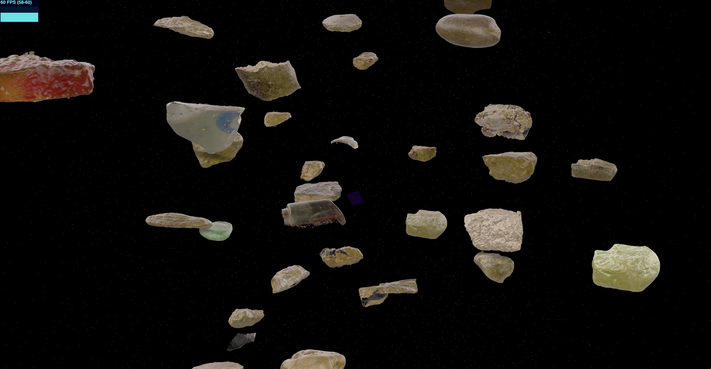
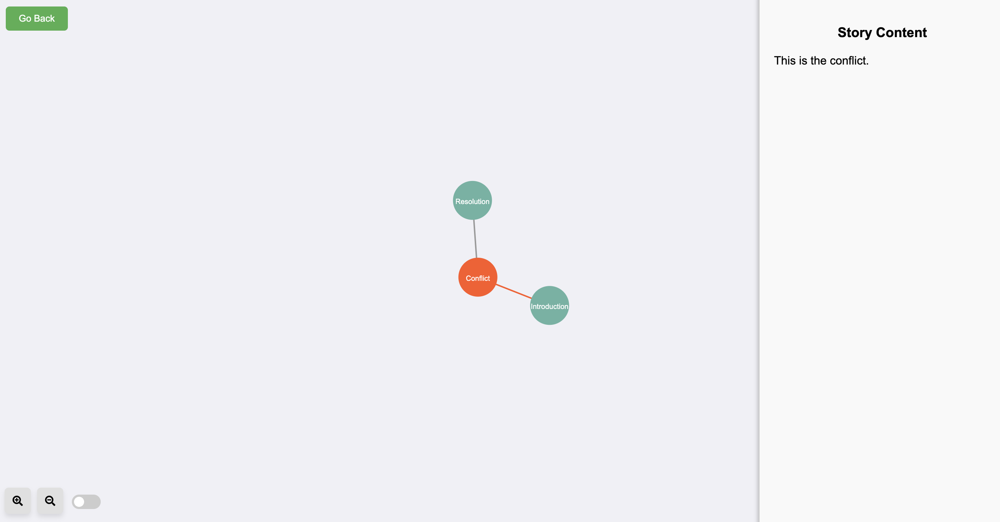
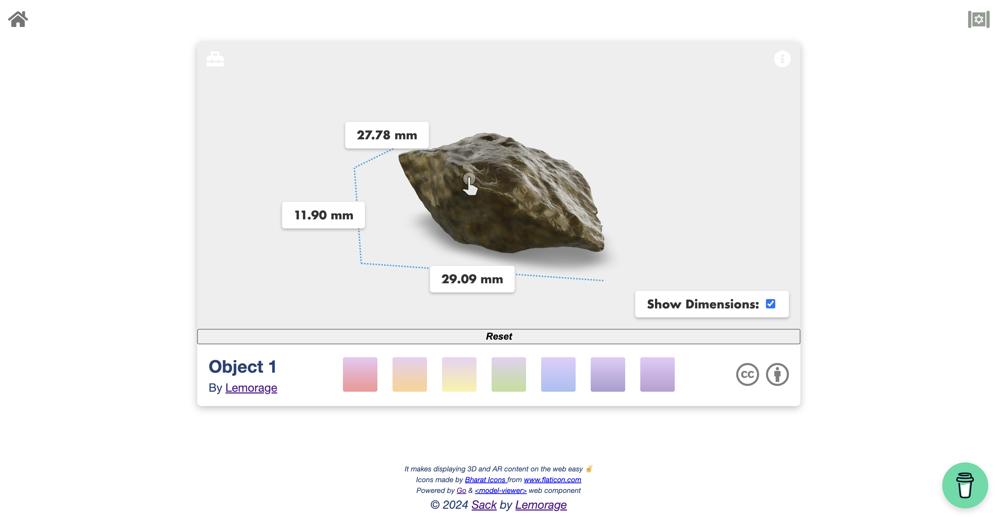

# Sack: A 3D Object Showcase

*Sack* is a web-based showcase for displaying multiple 3D objects in an immersive environment. This project features a universe-like background with floating 3D objects, a story page that visualizes the relationships between objects using an interactive graph, and detailed individual showcases for each object using Google’s `<model-viewer>`. It also supports multimedia integration with video, audio, and text annotations.

---

## Features

- **Universe-like 3D Scene**: View a dynamic background with floating 3D objects created using `three.js`.
- **Story Page with Interactive Graph**: Explore the history of the objects in a visual graph format powered by `D3.js`, with support for multimedia (video, audio, text) behind the story nodes.
- **3D Model Viewer**: Showcase individual 3D objects using Google's `<model-viewer>` with AR support for mobile devices.
- **Command-line options**: Some command-line options are available for developers to manage configurations and run the project.

## Quick Start

To get started with *Sack*, follow these instructions:

### 1. Clone the repository

```sh
git clone https://github.com/lemorage/sack.git
cd sack
```

### 2. Run the setup script

Make sure the setup script has execute permissions, and run it:

```sh
chmod +x setup.sh
./setup.sh
```

### 3. Start the application

You can start the application locally with:

```sh
./sack start
```

By default, the app runs on port `7536`. You can change the port using the command-line options described below.

## Command Line Options

The project offers a few command-line tools for developers:

- `start`: Starts the application on port 7536 (or specify a custom port using `--port`).
- `generate`: Generates a configuration list for 3D objects. You can batch generate multiple pages using the `--batch` option.

For help, run:

```sh
./sack --help
```

## Project Structure

```plaintext
.
├── cmd/
│   ├── auto_reload.go
│   ├── config.go
│   ├── handlers.go
│   ├── helpers.go
│   ├── main.go
│   └── middleware.go
├── configs/
│   ├── config.yaml
│   └── graph.json
├── ui/
│   ├── html/
│   │   ├── index.html        # Main 3D universe page
│   │   ├── graph.html        # Story page with interactive graph
│   │   ├── pages/            # Generated pages for individual objects
│   └── static/               # Assets for the frontend
│       ├── css/              # CSS files
│       ├── img/              # Image files
│       ├── js/               # JavaScript files
│       └── models/           # 3D model files (.glb, .usdz, .webp)
└── setup.sh                  # Setup script
```

- **`cmd/`**: Contains the Go-based backend server for serving the frontend files.
- **`configs/`**: Contains configuration files like `config.yaml` for page settings and `graph.json` for the story graph.
- **`ui/`**: Contains all frontend-related code, including HTML, CSS, JavaScript, and 3D models.

### Home Page (3D Floating Objects)

|  |
| :-: |
| The main page (`index.html`) uses `three.js` to render a background with floating 3D objects, creating a cosmic visual experience for users. Visitors can interact with objects by clicking them to explore more details. |

### Story Graph Page

|  |
| :-: |
| The `graph.html` page uses `D3.js` to display a visual graph, connecting 3D objects and their related stories. Each node in the graph may contain multimedia elements such as video, audio, and text annotations to enrich the story behind the objects. |

### 3D Object Showcase

|  |
| :-: |
| Individual 3D objects are showcased using Google’s `<model-viewer>`, which supports 3D viewing, zooming, and AR functionality for mobile users. The 3D models (`.glb`, `.usdz`) are hosted in the `static/models/` folder. |

## Configuration Files

### `config.yaml`

This file is used to configure the pages and 3D objects. The format allows you to specify the object details such as model path, poster image, and descriptions.

```yaml
pages:
  page1:
    ModelSrcPath: "/static/models/object1.glb"
    ModelIosSrcPath: "/static/models/object1.usdz"
    PosterPath: "/static/models/object1.webp"
    Description: "An ancient artifact found in a remote location."
    ModelName: "Artifact1"
    DesignerWebsite: "https://designerwebsite.com"
    DesignerName: "John Doe"
```

### `graph.json`

Defines the story relationships between the 3D objects, including nodes and links for the story graph page.

```json
{
  "nodes": [
    {
      "id": "node1",
      "keyword": "Artifact1",
      "story": "Discovered in 1920",
      "images": ["/static/img1.png"],
      "videos": ["/static/video1.mp4"],
      "audios": ["/static/audio1.mp3"] },
    {
      "id": "node2",
      "keyword": "Artifact2",
      "story": "Unearthed in a tomb",
      "images": ["/static/img2.png"],
      "videos": ["/static/video2.mp4"],
      "audios": ["/static/audio2.mp3"]
    }
  ],
  "links": [
    {
      "source": "node1",
      "target": "node2"
    }
  ]
}
```

Add additional nodes and links as needed to build your story graph.

## References

This project has benefited from the following:

1. [`<model-viewer>`](https://github.com/google/model-viewer) for 3D and AR object viewing.
2. [`three.js`](https://threejs.org) for 3D scene rendering.
3. [`D3.js`](https://d3js.org) for interactive data visualizations.
4. Icons by [Bharat Icons](https://www.flaticon.com/authors/bharat-icons)

## Acknowledgements

The 3D stone object displayed in this project is sourced from [Dawanshiju](https://artsandculture.google.com/asset/aerial-view-of-dawanshiju/_QHjNn2iL_6JrQ?hl=en), and is kindly shared by [Enza's Research Group](https://www.enzamigliore.com/).

## License

BSD-3. See [LICENSE](./LICENSE).
